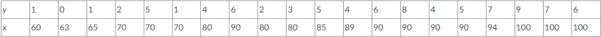
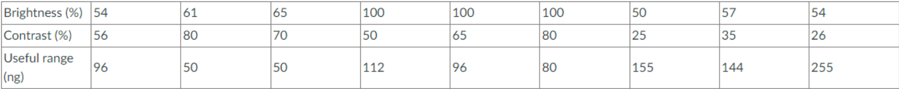

```{r setup, include=FALSE}
knitr::opts_chunk$set(echo = TRUE)
```

## Question 1

#### An article in the *Journal of Sound and Vibration* ["Measurement of Noise-Evoked Blood Pressure by Means of Averaging Method: Relation between Blood Pressure Rise and PSL" (1991, Vol. 151(3), pp. 383-394)] described a study investigating the relationship between noise exposure and hypertension. The following data are representative of those reported in the article.



### A. Draw a scatter diagram of y (blood pressure rise in millimeters of mercury) versus x (sound pressure level in decibels). Does a simple linear regression model seem reasonable in this situation?

A simple scatter plot diagram of the values listed in the table can be seen below:

```{r, echo=FALSE}
x <- c(60, 63, 65, 70, 70, 70, 80, 90, 80, 80, 85, 89, 90, 90, 90, 90, 94, 100, 100, 100)
y <- c(1, 0, 1, 2, 5, 1, 4, 6, 2, 3, 5, 4, 6, 8, 4, 5, 7, 9, 7, 6)
plot(x,y, pch=16, cex=1.2, col="blue", main="Blood Pressure vs Sound Pressure", xlab="Blood Pressure Rise (in mmHg)", ylab="Sound Pressure Level (in dB)")
```

Based on the given table, a straight line is not immediately obvious, but there is an upwards trend. This is enough reason to utilize a linear regression model.

### B. Fit the simple linear regression model using least squares. Find an estimate of $σ^2$

To use the least squares method, we first establish the equation of a line: $y=mx+b$

Where:

- **y** = The point on the y-axis
- **m** = Is the magnitude of the slope
- **x** = The point on the x-axis
- **b** = The y intercept

The general equation for **m**, or the slope, where **N** is the number of values is shown below:
$$m=\frac{N\sum(xy)-\sum x\sum y}{N\sum(x^2)-(\sum x)^2}$$

```{r, echo=FALSE}
library(knitr)
x <- c(60, 63, 65, 70, 70, 70, 80, 90, 80, 80, 85, 89, 90, 90, 90, 90, 94, 100, 100, 100)
y <- c(1, 0, 1, 2, 5, 1, 4, 6, 2, 3, 5, 4, 6, 8, 4, 5, 7, 9, 7, 6)
sums <- data.frame(x, y, x^2, x*y)
kable(sums, "pipe", col.names=c("$x$", "$y$", "$x^2$", "$xy$"), align=c("l", "l", "l", "l"), caption="Values needed for the equation:")
```

We can then find the sum of each of the values.

- $\sum x = 1656$
- $\sum y = 86$
- $\sum x^2 = 140176$
- $\sum xy = 7654$

Then we can proceed to plugging in the values with **N=20**, which results in the following equation:
$$m=\frac{20(7654)-(1656)(86)}{20(140176)-1656^2}=0.1742939331\approx 0.174$$

To find the value of **b**, we will utilize the equation:
$$b=\frac{\sum y-m\sum x}{N}$$

Plugging in the values we previously obtained:
$$b=\frac{86-(0.174)(1656)}{20}=-10.1072\approx-10.107$$

Giving us the linear equation:
$$y=0.174x - 10.107$$

The resulting line on the scatter plot can be seen below:

```{r, echo=FALSE}
x <- c(60, 63, 65, 70, 70, 70, 80, 90, 80, 80, 85, 89, 90, 90, 90, 90, 94, 100, 100, 100)
y <- c(1, 0, 1, 2, 5, 1, 4, 6, 2, 3, 5, 4, 6, 8, 4, 5, 7, 9, 7, 6)
plot(x,y, pch=16, cex=1.2, col="blue", main="Blood Pressure vs Sound Pressure", xlab="Blood Pressure Rise (in mmHg)", ylab="Sound Pressure Level (in dB)")
abline(-10.107, 0.174, col="orange")
```

In order to find $\sigma^2$, we will use the unbiased estimator. The equation of which is seen below:
$$\sigma^2=\frac{\sum_{i=1}^n e_i^2}{n-p}$$

### C. Find the predicted mean rise in blood pressure level associated with a sound pressure level of 85 decibels.

To find the predicted mean rise in blood pressure level at 85 decibels, we simply input 85 to the value of x in the linear equation:
$$y=0.174(85)-10.107=4.683$$

So we are given a value of 4.683, which is the predicted rise in blood pressure level when the sound pressure is at 85 decibels.

## Question 2

#### An article in *Optical Engineering* ["Operating Curve Extraction of a Correlator's Filter" (2004, Vol. 43, pp. 2775-2779)] reported on the use of an optical correlator to perform an experiment by varying brightness and contrast. The resulting modulation is characterized by the useful range of gray levels. The data follow:



### A. Fit a multiple linear regression model to these data.

### B. Estimate $σ^2$.

### C. Compute the standards of errors of the regression coefficients. 

### D. Predict the useful range when brightness = 80 and contrast = 75.

### E. Test for significance of regression using $α=0.05$. What is the P-value for this test?

### F. Construct a t-test on each regression coefficient. What conclusions can you draw about the variables in this model? Use $α=0.05$.